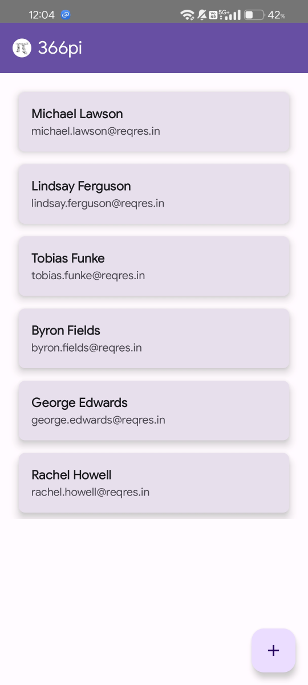
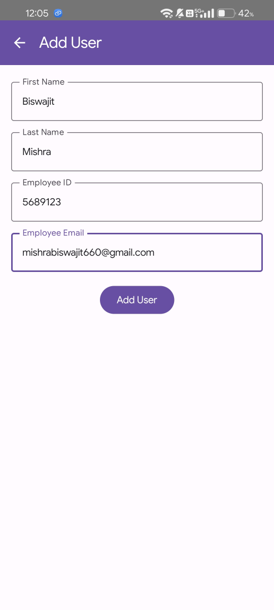
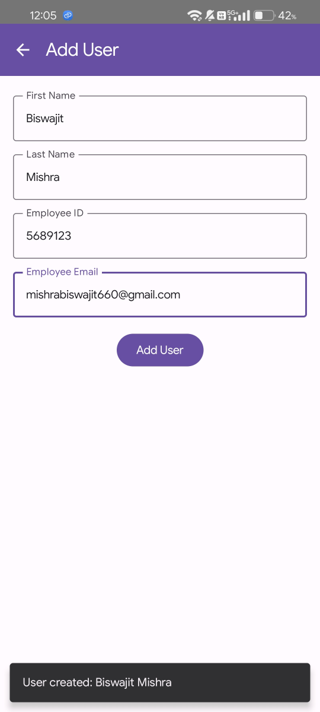
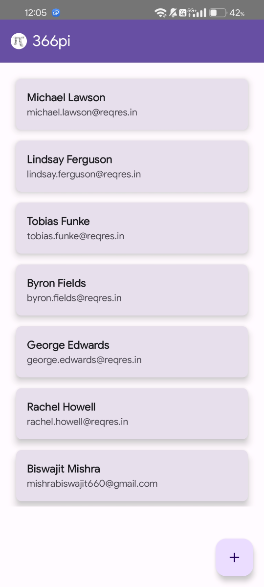
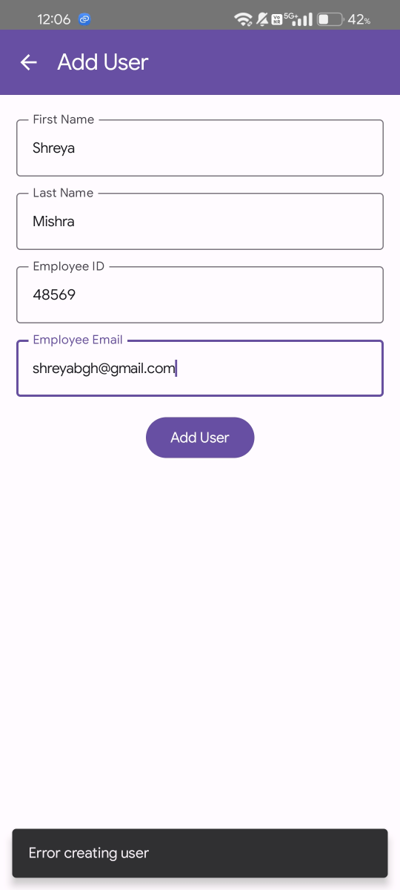
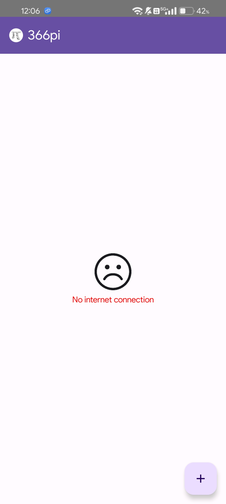

# 366pi User Management App

## Overview
This project is an Android application built with Jetpack Compose, Room DB, and Retrofit for managing user profiles. It follows the MVVM architecture and interacts with the [ReqRes API](https://reqres.in/) for user data.

## Screenshots
<div style="display: flex; flex-wrap: wrap; gap: 10px;">











<div>

## Download
You can download the latest APK from the [Releases](https://github.com/mishrabiswajit/366pi-roomdb-reqres/releases) page.

## Features
- **Fetch and Display Users**: Fetch users from the ReqRes API and display them in a list.
- **Add User**: Add new users via a form and sync with the ReqRes API.
- **Offline Storage**: Users are stored locally in a Room database.
- **Error Handling**: Display appropriate messages when there's an issue with the API or database operations.

## Architecture
- **MVVM**: The project follows the Model-View-ViewModel (MVVM) architecture.
- **Room**: Used for local database storage.
- **Retrofit**: Handles network operations for communicating with the ReqRes API.
- **Jetpack Compose**: UI toolkit used for building the user interface.

## Components

### MainActivity
- **Purpose**: Entry point of the app.
- **Responsibilities**: Displays the home page or the add user page based on the state.

### UserRepository
- **Purpose**: Manages data operations between the local database and the API.
- **Functions**:
  - `fetchAndStoreUsers(apiService: ApiService)`: Fetches users from the API and stores them in the database.
  - `getUsersFromDb()`: Retrieves users from the local database.
  - `addUser(apiService: ApiService, user: User)`: Adds a user to the API and database, ensuring synchronization.

### UserViewModel
- **Purpose**: Manages UI-related data and business logic.
- **Responsibilities**:
  - Initializes user data from the database.
  - Handles user addition and synchronization with the API.
  - Provides LiveData for observing changes in user data and error messages.

### Database Setup
- **AppDatabase**: Room database setup with a single entity, `User`.
- **UserDao**: Data Access Object for user-related database operations.

### API Integration
- **ApiService**: Retrofit interface for API endpoints.
  - `@GET("users?page=2")`: Fetches users.
  - `@POST("users")`: Creates a new user.

## Getting Started

### Prerequisites
- Android Studio
- Kotlin
- Basic knowledge of MVVM architecture

### Setup
1. **Clone the Repository**:
   ```bash
   git clone https://github.com/mishrabiswajit/366pi-roomdb-reqres.git
2. Open Project in Android Studio:

    - Open Android Studio and select "Open an existing project."
    - Navigate to the cloned repository and open it.

3. Build and Run:

    - Ensure that your `gradle` files are up-to-date.
    - Build and run the application on an emulator or physical device.

## Contributing

- Fork the repository and create a pull request for any improvements or bug fixes.

## License

This project is licensed under the MIT License. See the [LICENSE](LICENSE) file for details.

## Contact
For any questions or issues, please reach out to mishrabiswajit660@gmail.com.